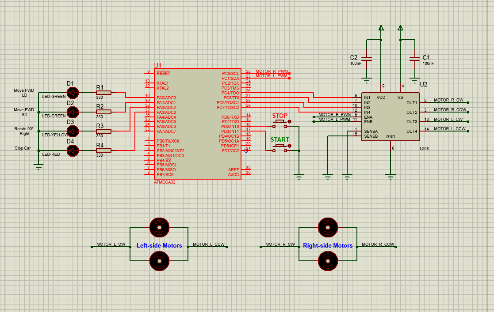

# AC Control Project
#### Embedded Systems - Level 1
#### Author: Team 1 - Hacker Kermit
- #### Members:
    - Mahmoud Mowafey
    - Abdelrahman Walaa
    - Hossam Elwahsh
    - Tarek Elgohary

## Brief
> Embedded C application for controlling a temperature sensor, and adjust the desired temperature.

## Quick Links
> - `Project Documentation`
    >     👉 [PDF](Documents/Hacker%20Kermit%20-%20AC%20Control%20Design.pdf)
    >     👉 [Google Docs](https://docs.google.com/document/d/1zUYskV-cAppTGXI2pj8mt7Ny0XqNEJZvHcIalnobWQU/edit?usp=sharing)
> - `Video` 👉 [Watch on Youtube](https://youtu.be/0Qr8nxBq1WU)
> - `Team Backlog` 👉 [Google Sheets](https://docs.google.com/spreadsheets/d/1Lk05spYUBcoQDUMgQl8S5kLvkQC_jN6cfbnQXrIj39k/edit?usp=sharing) 👉 [Excel](Documents/Hacker%20Kermit%20-%20Team%20Log%20AC%20Control.xlsx)
> - `Test Protocol` 👉 [Google Sheets](https://docs.google.com/spreadsheets/d/1Lk05spYUBcoQDUMgQl8S5kLvkQC_jN6cfbnQXrIj39k/edit?usp=sharing#gid=1200153160) 👉 [Excel](Test%20Cases/Hacker%20Kermit%20-%20Test%20Protocol%20AC%20Control.xlsx)
> - ---
> ### Technical
> - `Proteus Simulation (Proteus 8.13)` 👉 [Simulation_8.13](Simulation/AC_controller_Proteus8.13.pdsprj)
> #### for older proteus version you can import the proteus clip file (pdsclip) and update the MC hex file:
> - `Proteus clip file` 👉 [Proteus PDSCLIP](Simulation/AC%20controller.pdsclip)
> - `Project Hex` 👉 [AC Control System.hex](Simulation/AC_Control.hex)

    Allowed Temperatures:
    Temp:     18 19 20 21 22 23 24 25 26 27 28 29 30 31 32 33 34 35  in C°
              ↓  ↓  ↓  ↓  ↓  ↓  ↓  ↓  ↓  ↓  ↓  ↓  ↓  ↓  ↓  ↓  ↓  ↓
    Index:    0  0  1  2  3  4  5  6  7  8  9 10 11 12 13 14 15 15   character index on LCD
    Visual:   ■  |  |  |  |  |  |  |  |  |  |  |  |  |  |  |  |  ■   character visible on LCD

    Min/Max = ■

### Assumptions
- We assume that room temperature won’t go below `10 °C`, or go higher than `99 °C`

### Requirements
#### Constants:
- Default temperature: 20 °C
- Minimum temperature: 18 °C
- Maximum temperature: 35 °C

#### Flow:
1. Show “welcome” (1 second)
2. Show “default temperature: 20 °C” (1 second)
3. Goto `Adjust Screen`
---
#### `Adjust Screen`
1. Show “Please choose required temperature” (0.5 second)
2. Show Adjust Screen model:
 
        ====================
        Min:18  20   Max: 35
        | | 		     < progress bar to visualize temperature
        ====================

3. Wait for user input to increase/decrease temperature
    - Use keypad button 1 for increasing (updates temp & progress bar)
    - Use keypad button 2 for decreasing (updates temp & progress bar)
    - Use keypad button 3 for Set and Start AC
   
4. Timeout after 10 seconds if no input, set desired temperature to 20 °C then goto `Running Screen`
4. Otherwise if Set button was pressed, save the desired temperature in memory then goto `Running Screen`
---
#### `Running Screen`
- Button 1,2,3 are disabled (increment/decrement/set) show an error if pressed for 0.5 second.
- Buttons 4,5 are enabled (4: Adjust, 5: Reset)
- Running Screen:

        ==================
        ⏰   < buzzer icon visible if current temp from sensor
        Current Temp:           20	     is greater than desired temperature
        ==================
- Current temp is constantly updated from temperature sensor
  - If `current temperature > desired temperature` Show buzzer 🔔 icon on LCD and turn the buzzer on until the room temperature goes back down below the desired temperature
  - If Button-4 `(Adjust)` was pressed, halt and go back to `Adjust Screen` to allow re-adjusting temperature.
  - If Button-5 `(Reset)` was pressed, halt, reset desired temperature to default (20 °C, show “Reset to default temp: 20 °C” then resume back again to `Running Screen`
   

---------

## Circuit Schematic

## Layered Architecture

